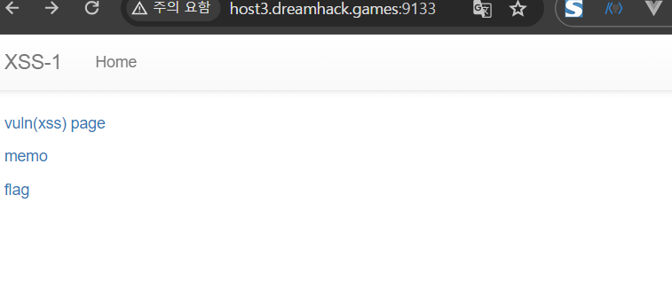
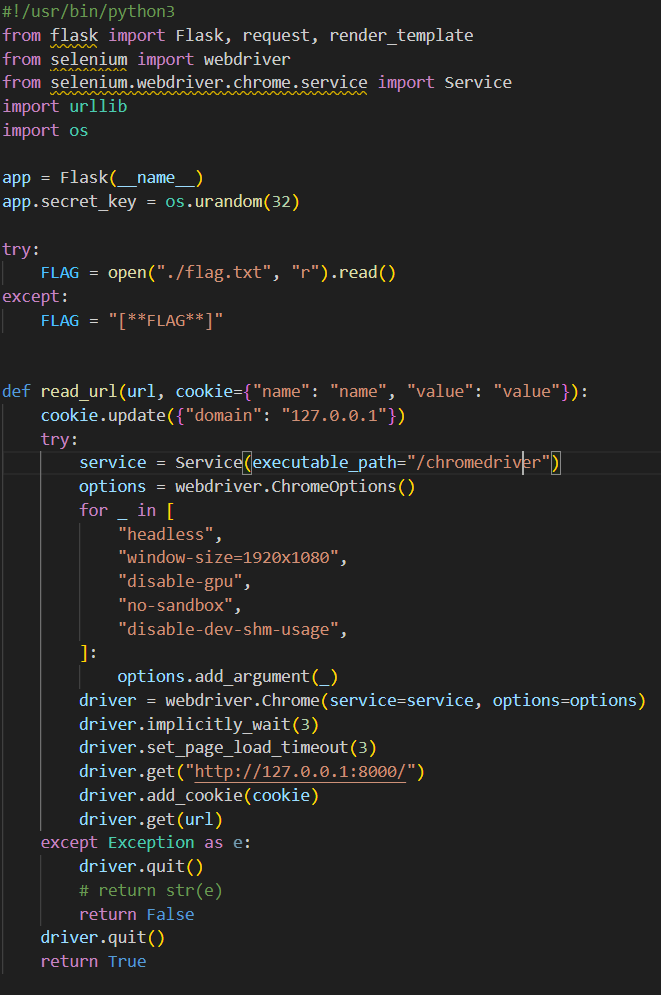
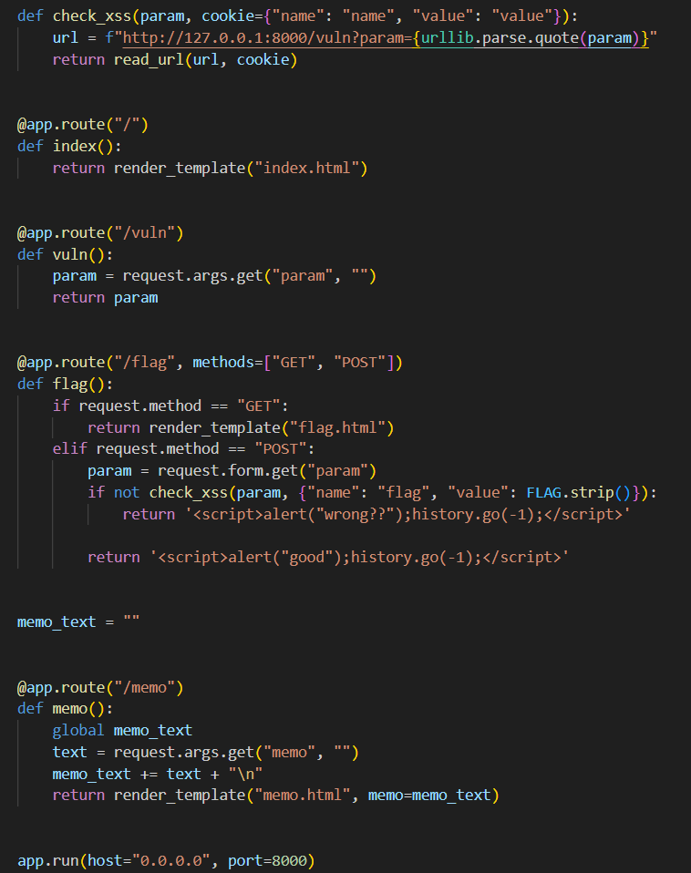
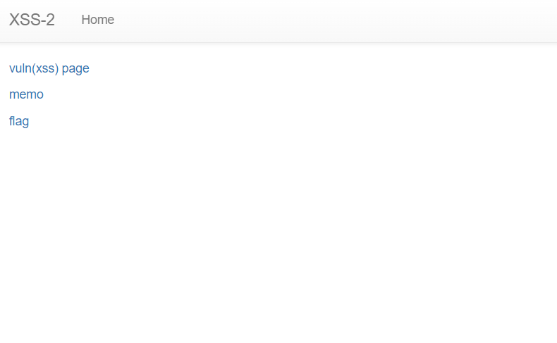

# dreamhack

## Cross Origin Resource Sharing (CORS)

- Same Origin Policy 제한 완화
    - **웹 서비스에서 동일 출처 정책인 SOP를 완화하여 다른 출처의 데이터를 처리 해야 하는 경우도 있습니다.**
    - 교차 출처 리소스 공유 (Cross Origin Resource Sharing, CORS)
    - |Header|설명|
        |-|-|
        |Access-Control-Allow-Origin|헤더 값에 해당하는 Origin에서 들어오는 요청만 처리|
        |Access-Control-Allow-Methods|헤더 값에 해당하는 메소드의 요청만 처리|
        |Access-Control-Allow-Credentials|쿠키 사용 여부를 판단합니다. 예시의 경우 쿠키의 사용을 허용|
        |Access-Control-Allow-Headers|헤더 값에 해당하는 헤더의 사용 가능 여부를 나타냅니다.|
    - **브라우저는 수신측의 응답이 발신측의 요청과 상응하는지 확인하고, 그때야 비로수 POST 요청을 보내 수신측의 웹리소스를 요청하는 HTTP 요청**
    - JSON with Padding : 과거의 방식, CORS 사용 권장
## 요약
- Same Origin Policy (SOP) : 동일 출처 정책, 현재 페이지의 출처가 아닌 다른 출처로부터 온 데이터를 읽지 못하게 하는 브라우저의 보안 메커니즘
- Same Origin : 현재 페이지와 동일한 출처
- Cross Origin : 현재 페이지와 다른 출처
- Cross Origin Resource Sharing(CORS) : 교차 출처 리소스 고유

## ClientSide: XSS

- Cross Site Scripting의 약어가 XSS인 이유 : CSS와 중복으로 XSS으로 강제 개명
- XSS 발생 예시와 종류
- |종류|설명|
    |-|-|
    |Stored XSS|XSS에 사용되는 악성 스크립트가 서버에 저장되고 서버의 응답에 담겨오는 XSS|
    |Reflected XSS|**악성 스크립트가 URL에 삽입** **서버의 응답에 담겨오는** XSS|
    |DOM-based XSS|**악성 스크립트가 URL Fragment에 삽입**|
    |Universal XSS|클라이언트의 브라우저 혹은 브라우저의 플러그인에서 발생하는 취약점으로 SOP 정책을 우회하는 XSS|
- 1. 쿠키 및 세션 탈취 공격 코드
    2. 페이지 변조 공격 코드
    3. 위치 이동 공격 코드

- Stored XSS 
- Reflected XSS
    - Click Jacking or Open Redirect
- Cross Site Scripting (XSS): 클라이언트 사이드 취약점,
- Stored XSS : 악성 스크립트가 서버 내에 존재, 이용자가 저장된악성 스크립트를 조회할 때 발생
- Reflected XSS : 악성 스크립트가 이용자 요청 내에 존재, 이용자가 악성 스크립트가 포함된 요청을 보낸 후 응답을 출력할 때 발생

## Exercise:XSS
- |페이지|설명|
    |-|-|
    |/|인덱스 페이지입니다.|
    |/vuln|이용자가 입력한 값을 출력합니다.|
    |/memo|이용자가 메모를 남길 수 있으며, 작성한 메모를 출력합니다.|
    |/flag|전달된 URL에 임의 이용자가 접속하게끔 합니다. **해당 이용자의 쿠키에는 FLAG가 존재** |

## 웹 서비스 분석
- 취약점 분석
- memo : **render_template** , **memo.html** , **render_template** 함수는 전달된 템플릿 변수를 기록할 때 HTML 엔티티코드로 변환해 저장하기 때문에 XSS가 발생하지 않습니다.

## 익스플로잇
- |속성|설명|
    |-|-|
    |location.href|전체 URL을 반환하거나, URL을 업데이트할 수 있는 속성값입니다.|
    |document.cookie|해당페이지에서 사용하는 쿠키를 읽고, 쓰는 속성값입니다.|

## 쿠키 탈취
- 임의 이용자의 쿠키를 탈취하기 위한 방법은 다음과 같이 두 가지
    - memo 페이지 사용
        - flag 엔드포인트에서 다음과 같은 익스플로잇 코드를 입력하면, memo 엔드포인트에서 임의 이용자의 쿠키 정보를 확인할 수 있습니다.
        - 
    - 웹 서버 사용
        - 외부에서 접근 가능한 웹 서버를 통해 탈취한 쿠키를 확인할 수 있다.
        - 해당 서비스에서 제공하는 Request Bin 기능은 이용자의 접속 기록을 저장하기 때문에 해당 정보를 확인할 수 있다.
        - 

        
        
        

## Exercise: XSS-2
- /vuln : 이용자가 입력한 값을 출력
    - render_template 함수 사용 : Flask 웹프레임워크에서 제공하는 함수
    - param에 를 입력하더라도 XSS가 발생하지 않는다
- /memo : 이용자가 메모를 남길 수 있으며, 작성한 메모
    - memo 파라미터 값을 render_template 함수를 통해 출력하는 것
- /flag : 전달된 URL에 임의 이용자가 접속하게끔 합니다. 해당 이용자의 쿠키에는 FLAG가 존재 
    - check_xss 함수에서는, 이용자가 flag에 POST로 전송한 param 값이 XSS 공격에 사용될 수 있는 값인지 아닌지를 확인. check_xss에서는, 이용자가 flag 페이지에 입력한 param을 포함하여 vuln 페이지에 접근하는 URL을 생성
    - read_url 함수를 통해 vuln 페이지에 접근한는 URL과 사용자의 쿠키가 전달
## 취약점 분석
|var content = document.getElementById('example').innerHTML;|읽기:요소의 내부 HTML을 가져옵니다.|
|-|-|
|document.getElementById('example').innerHTML='New Content';|쓰기:요소의 내부 HTML을 변경합니다.|

## vuln.html
- 
- 파라미터의 값을 통해 '쓰기'를 수행

## 익스플로잇
- XSS 취약점을 통해 임의 이용자의 쿠키를 탈취
- 익스플로잇 코드
- 

## ClientSide: CSRF
- 교차 사이트 요청 위조(Cross Site Request Forgery, CSRF)
- Cross Site Request Forgery(CSRF)