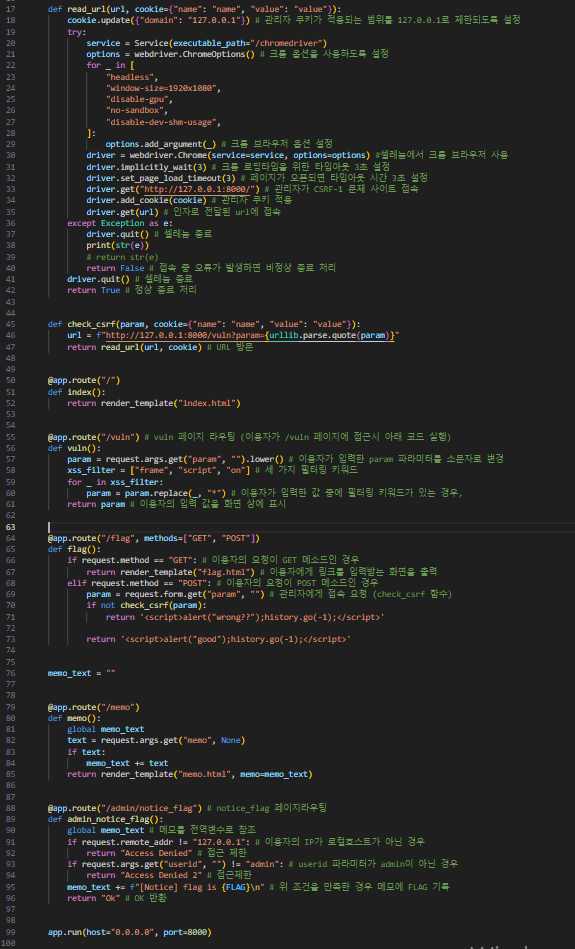
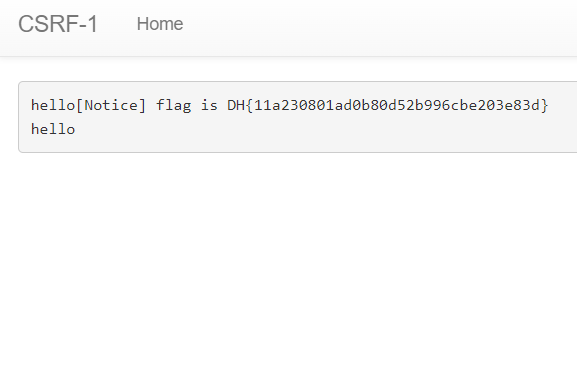

# dreamhack

## Cross Site Request Forgery(CSRF)

### 이용자의 송금요청
- GET /sendmoney?to=dreamhack&amount=1337 HTTP/1.1
- HOST: bank.dreamhack.io
- Cookie: session=IeheighaiToo4eenahw3
### HTML img 태그 공격 코드
- 

### Javascript 공격 코드
- 새 창 띄우기: window.open('http://bank.dreamhack.io/sendmoney?to=dreamhack&amount=1337')
- 현재 창 주소 옮기기 : location.href = 'http://bank.dreamhack.io/sendmoney?to=dreamhack&amount=1337';location.replace('http://bank.dreamhack.io/sendmoney?to=dreamhack&amount=1337');

### 요약 
- XSS와 CSRF의 차이
- 공통점
    - 두 개의 취약덤은 모두 클라이언트를 대상으로 하는 공격이며, 이용자가 악성 스크립트가 포함된 페이지에 접속
- 차이점
    - XSS는 인증 정보인 세션 및 쿠키 탈취를 목적으로 하는 공격이며, 공격할 사이트의 오리진에서 스크립트를 실행
- Cross Site Request Forgery (CSRF) : 사이트 간 요청 위조. 이용자가 자신의 의지와 무관하게 공격자가 의도한 행위를 특정 웹사이트에 요청하게 만드는 공격

## CSRF
### 문제 목표 및 기능 요약
- |엔드포인트|설명|
    |-|-|
    |/|인덱스 페이지|
    |/vuln|이용자가 입력한 값을 출력합니다. 이 때 XSS가 발생할 수 있는 키워드 필터링|
    |/memo|이용자가 메모를 남길 수 있으며, 작성한 메모|
    |/admin/notice_flag|**메모에 FLAG를 작성하는 기능** 이 기능은 로컬호스트에서 접속해야하고, 사이트 관리자만 사용|
    |/flag|전달된 URL에 임의 이용자가 접속|

### 웹 서비스 분석
- 엔드포인트 : /vuln
    - XSS 공격이 아닌 CSRF 공격을 통해서 관리자의 기능을 수행하는 것이기 때문에 일부 키워드를 필터링
- 엔드포인트 : /memo
    - 이용자가 전달한 **memo** 파라미터 값을 기록, **render_Template** 함수를 통해 출력
- 엔드포인트 : /admin/notice_flag
    - **/admin/notice_flag** 페이지 자체는 모두가 접근할 수 있고, **userid** 파라미터에 **admin** 값을 넣는 것도 가능. 하지만 일반 유저가 해당 페이지에 접근할 때의 IP주소는 조작할 수 없다.
    - 로컬호스트 (Localhost)
        - **로컬호스트는 컴퓨터 네트워크에서 사용하는 호스트명으로 자기자신의 컴퓨터를 의미**
- 엔드포인트: /flag
    - GET : 이용자에게 URL을 입력받는 페이지를 제공
    - POST : param 파라미터 값을 가져와 check_csrf 함수의 인자로 넣고 호출한다. check_csrf 함수는 인자를 다시 CSRF 취약점이 발생하는 URL의 파라미터로 설정, read_url 함수를 이용해 방문. 127.0.0.1의 호스트로 접속하게 된다. read_url 함수는 셀레늄을 이용해 URL을 방문.
## 취약점 분석
- /vuln 기능 : 이용자의 입력 값을 페이지에 출력.
    - 이 때 입력값에서 frame, script, on 세 가지의 키워드를 필터링하기 때문에 xss 공격은 불가능. 하지만, 필터링 키워드 이외의 꺽쇠(<,>)를 포함한 다른 키워드와 태그는 사용할 수 있기때문에 CSRF 공격을 수행할 수 있다.

- /admin/notice_flag : 페이지를 로컬호스트에 접근해야 한다. 이를 위해 CSRF 공격으로 /vuln 페이지를 방문하는 로컬호스트 이용자가 /admin/notice_flag 페이지로 요청을 전송하도록 공격 코드 작성
- CSRF 취약점 테스트: 
    - 로컬호스트에 위치하는 이용자가 /admin/notice_flag 페이지를 방문하도록 해야하기 때문에 아래와 같이 공격 코드 작성, 이때, userid 파라미터가 admin인지 검사하는 부분이 존재하기 때문에 해당 문자열을 포함
    
    