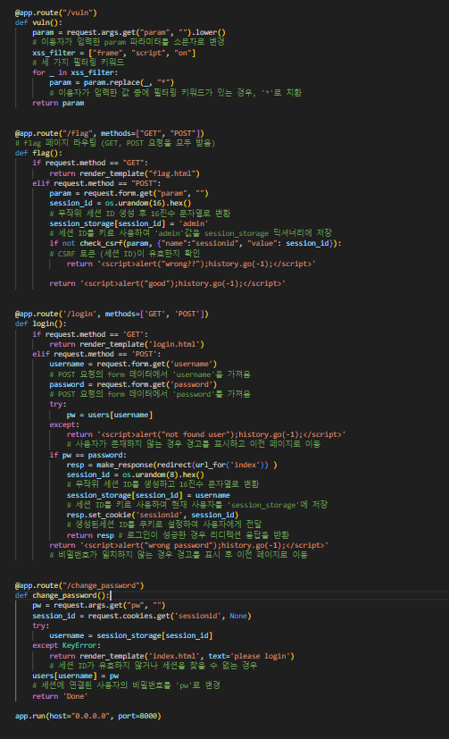

# dreamhack

## CSRF-2
- |엔드포인트|설명|
    |-|-|
    |/|인덱스 페이지 입니다.|
    |/vuln|이용자가 입력한 값을 출력. XSS가 발생할 수 있는 키워드는 필터링|
    |/flag|GET 및 POST 요청을 처리하며, CSRF 공격 방어와 세션 관리를 수행하는 역할|
    |/login|로그인 페이지를 처리하며, 사용자가 유효한 사용자 이름과 비밀번호를 제출하면 세션을 설정하고, 사용자를 다른 페이지로 리디렉션하는 역할|
    |/change_password|비밀번호 변경을 처리하며, 사용자의 세션을 확인한 후, 새로운 비밀번호를 설정|
## 웹서비스 분석
- 엔드포인트 : /vuln
    - param 파라미터의 값을 출력합니다.
        - "frame", "script", "on" 세 가지의 악성 키워드가 포함되어 있으며 이를 '*' 문자로 치환
- 엔드 포인트 : /flag
    - /flag 페이지를 구성하는 코드. 메서드에 따라 다른 기능을 수행
    - GET
        - 이용자에게 URL을 입력받는 페이지를 제공
    - POST
        - param 파라미터 값을 가져온 뒤, session_id를 생성하고, 생성한 session_id를 키로 사용하여 admin 값을 session_storage 딕셔너리에 저장
        - 그 후 check_csrf 함수를통해 session_id가 유효한지 확인하고 적잘한 경고 메시지를 반환
- 엔드포인트 : /login
    - 아래 코드는 /login 페이지를 구성하는코드.
    - GET
        - 이용자에게 username와 password를 입력받는 페이지를 제공
    - POST
        - username과 password 파라미터 값을 가져와 pw와 비교. 로그인이 성공한 경우, 사용자를 "index"페이지로 리디렉션하도록 새로운 응답 객체(resp)를 만든다. 나중에 사용자를 식별하는데 사용할 session_id를 생성하고 생성한 session_id로 session_storage에 사용자의 이름을 저장
        - 리다이렉션된 응답을 반환하여 사용자를 "index" 페이지로 라다이렉션

- 엔드포인트 : /change_password
    - 브라우저 쿠키에서 "session_id"값을 가져와 session_id 변수에 저장
    - session_id가 세션 저장소에 있지 않으면 "please login" 메시지와 함께 "index.html"
    - users[usename]=pw 세션을 통해 확인된 사용자의 비밀번호를 새로운 비밀번호 pw로 변경

## 취약점 분석
- /vuln 기능은 이용자의 입력 값을 페이지에 출력.
    - 이 때 입력값에서 frame, script, on 세 가지의 키워드를 필터링하기 때문에 XSS 공격은 불가능. 하지만 필터링 키워드 이외의 (<,>)를 포함한 다른 키워드와 태그는 사용할 수 있기 때문에 CSRF 공격을 수행할 수 있다.

## 익스플로잇
- 익스플로잇
    - /flag 페이지에서 CSRF 공격이 가능. /flag 페이지에서 admin의 session_id가 저장되므로 공격 코드가 삽입된 /flag 페이지에서 admin의 pw를 변경하기 위해서는 /change_password 페이지를 접근해야 합니다. 이를 위해 CSRF 공격으로 /flag 페이지를 방문하는 이용자가 /change_password
    - 

    