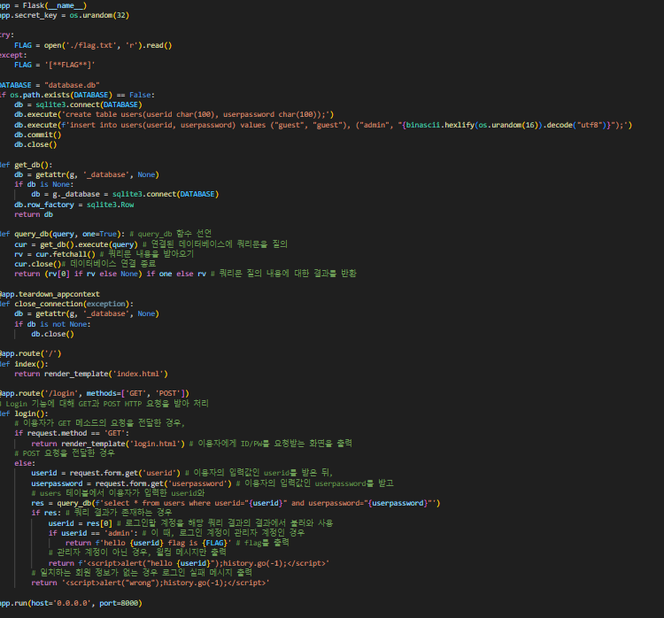
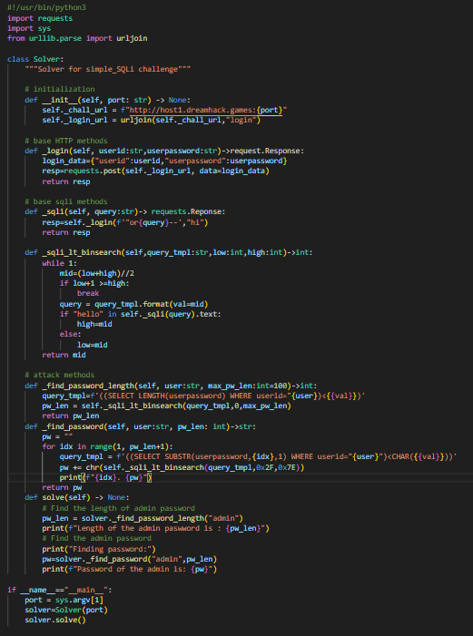

# dreamhack

- SQL Injection 기법
    - 요청: "아이디가 Dreamhack이고, 비밀번호가 Password인 계정으로 로그인하겠습니다."
        - 로그인 성공여부 password 판정
    - "아이디가 admin인 계정으로 로그인하겠습니다."
        - DBMS는 비밀번호 일치 여부를 검사하지 않고, 아이디가 admin인 계정을 조회한 후 이용자에게 로그인 결과를 반환

# SQL Injection
- Figure2
    - 로그인 기능을 위한 쿼리
- Figure3
    - user_pw 조건문이 사라진 것을 확인
    - SQL Injection으로 조작한 쿼리

- uid = 'admin'--' and upw='';
    - '--','#','/**/'

# Blind SQL Injection
- DBMS 상대로 스무고개하기 
- ASCII, SUBSTR
- ascii(substr(upw,1,1))=1
- requests 모듈 GET(URL과 Header, Parameter와 함께 요청), POST(URL과 Header, Body)
- Blind SQL Injection
    - 비밀번호에 포함될 수 있는 문자를 string 모듈을 사용해 생성, 한 바이트씩 모든 문자를 비교하는 반복문을 작성
# 키워드
- SQL injection : SQL 쿼리에 이용자의 입력 값을 삽입해 이용자가 원하는 쿼리를 실행할 수 있는 취약점
- Blind SQL Injection : 데이터 베이스 조회 후 결과를직접적으로 확인할 수 없느 경우 사용할 수 있는 SQL injection 공격 기법

- |기능명|설명|
    |-|-|
    |/login|입력받은 ID/PW를 데이터베이스에서 조회하고 이에 해당하는 데이터가 있는 경우 로그인을 수행|

# 웹 서비스 분석
- 데이터베이스 스키마
- 데이터베이스 구조
    - |userid|userpassword|
        |-|-|
        |guest|guest|
        |admin|랜덤 16바이트 문자열을 Hex 형태로 표현(32바이트)|
- 엔드포인트: /login
    - GET
        - userid와 userpassword를 입력할 수 있는 로그인 페이지를 제공. userid와 password 입력창에 guest를 입력하면 로그인을 수행
    - POST
        - 이용자가 입력한 계정 정보가 데이터베이스에 존재하는 지 확인. 이때, 로그인계정이 admin일 경우 FLAG 출력

# 취약점 분석
- 취약점 분석
    - 로그인을 우회하여 풀이하는 방법
    - 비밀번호를 알아내고 올바른 경로로 로그인 하는 방법
    - RawQuery를 생성할 때, 이용자의 입력값이 쿼리문에 포함되면 SQL Injection 취약점에 노출될 수 있다.

# 익스플로잇
- 익스플로잇
    - userid가 admin인 계정으로 로그인
    - SELECT * FROM users WHERE userid="{userid}" AND userpassword="{userpasswor}"

# Exercise: Blind SQL Injection
- 배경 지식
    - Python을 사용해 Blind SQL Injection 공격 스크립트 작성
- 서비스 요약
    - |기능명|설명|
        |-|-|
        |/login|이용자에게 ID와 비밀번호를 입력받고, 이를 데이터베이스에서 조회하여 이용자를 인증|
- Blind SQL Injection
    - Blind SQL Injection, Blind SQL Injection(BSQLi) 스무고개
- 로그인 요청의 폼 구조 파악
    - 개발자 도구의 네트워크 탭 열고, Preserve log 클릭
    - userid에 guest, password에 guest를 입력하고 login 버튼 클릭
    - 메세지 목록에서 /login으로 전송된 POST 요청 찾기
    - 하단의 Form Data 확인
    - 로그인할 때 입력한 userid 값은 userid로 password는 userpassword로 전송됨을 확인

